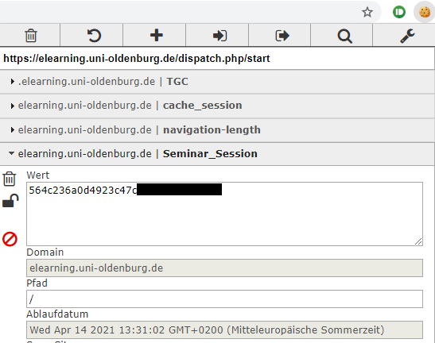

# StudIP-Downloader
Ein kleine Tool, um die Dateien aller Kurse aus dem StudIP herunterzuladen. Aktuell nur für die Uni Oldenburg getestet. Andere Universitäten und Hochschulen, die StudIP verwenden sollte aber auch funktionieren.

## Download 
https://github.com/yannik995/StudIP-Downloader/releases

### Wie wird das Tool verwendet?

1. Zip Archiv herunterladen, entpacken.
2. StudIPDownloader.exe starten, StudIP URL eintragen z.B.: https://elearning.uni-oldenburg.de/
3. Wert des Seminar_Session Cookie aus dem Browser eintragen. 
(Einloggen und Cookies z.B. mit EditThisCookie anzeigen lassen:
)
 
Alternativ kann auch Benutzernamen und Passwort als Parameter hinter der Anwendung eingetragen werden und optional ein zusätzliches True, um die Daten zu speichern:
`StudIPDownloader.exe Username Passwort True`
  
4. Lokalen Pfad eintragen
5. Nun werden alle Dateien heruntergeladen

Die Einstellungen werden gespeichert und beim nächsten Start muss nur ggf. der Wert des Cookies neu eingetragen werden.

Es werden immer nur die neuen oder geänderten Dateien heruntergeladen.

